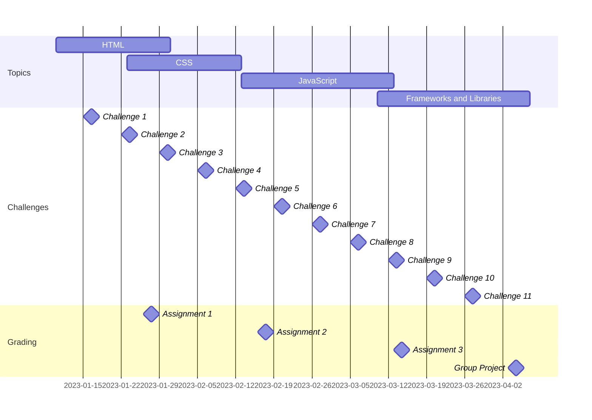

# IMD1005
Unpack the whole cirriculum

<!-- 

Slide notes: 

* So, Web Development is huge 
* And, I'm going to be honest with you, this course is quite large
* We are going to cover a lot of topics
* They're all critical, they're all necessary, and I've tried my best to set everything up so that we follow a logical order to get to where we need to go 

-->

---
title: Welcome
level: 2
layout: two-cols-header
---

# What we cover
Everything you need to know to get started with Web Development

::left::

* Core HTML Technologies
  * HTML5
  * CSS3
  * JavaScript ES13
  * (including a11y)
  * APIs
* Libraries and frameworks
  * TailwindCSS
  * VueJS
  * Nuxt

::right::

* Modern front end tooling
  * Git
  * GitHub
  * VSCode
  * ESLint
  * Prettier
  * Node
  * NPM
  * Vite
  * Deployments

<!-- 

Slide notes: 

* Okay, so here is the list of topics and some of tooling that we are going to cover in the next 13 weeks
* Today we're talking about How the web works
* And in future lessons were going to cover 
  * HTML5 - which is the building blocks of our web pages - how to mark up documents in a compliant way and use all of the sementic tags properly 
  * CSS3 - what we use to style our pages - to be make them really magical with modern CSS
  * and JavaScript - what we use to add important user interactions to our pages
  * We also talk about accessibility (or referred to as "a11y")
  * We'll dive into some modern tech stacks and use libraries like TailwindCSS, VueJS and Nuxt
  * And then we've got a whole list of modern tools that you'll get to use and experiment with. These are the exact same tools you're going to use when you land in industry, so it's really important you get familiar with them now 

-->

---
title: Key
level: 2
layout: image-right
image: /images/slides/intro/the-course/developer.jpg
---

# The Key
Learning how to learn new things

* It's okay if nothing on the previous slide made any sense to you
* We're going to get through this all together
* The most important thing is that you learn how to learn new things

<!-- 

Slide Notes: 

* The only thing that's constant is change in this industry
* Frameworks and tools that were popular 5 years ago are long gone
* And new frameworks and tooling are coming up like weeds 
* You have to be comfortable with change and with learning new things all the time in this industry

-->

---
title: Schedule
level: 2
---

# Our schedule
Journey through the different topics

<!-- 

Slide Notes: 

-->

---
title: Grading
level: 2
---

# Grading
You got this!

|**Evaluation**|**Description**|**Due Date**|**Mark**|
|---|---|---|---|
|Assignment 1|Research project - designing a small website|2023-01-27|15%|
|Assignment 2|Build a few web pages using HTML5 and CSS3|2023-02-17|20%|
|Assignment 3|Make an interactive web app with JavaScript|2023-03-14|25%|
|Group Project (Code)|Build something awesome 🚀|2023-04-04|30%|
|Group Project (Presentation)|Show the thing 👫|2023-04-04|10%|

---
title: How do we want to work
level: 2
layout: image-right
image: /images/slides/intro/the-course/coffee-code.jpg
---

# How we work
Laying out how we want to work as a team

* Please come to class
* Lecture slides will always be posted online
* Brightspace for course updates, grades, and urgent announcements 
* GitHub for assignments, challenges and exercises
* Assignments are due for noon (11:59 AM)
* Instant messaging:
  * MS Teams (Carleton Accounts); or 
  * MS Teams (Algonquin Accounts)

<!-- 

Slide notes: 

* Do we want to use MS Teams with Algonquin or Carleton Accounts?
* Or do we want to use something else like Slack?

-->

---
title: Late Policy
level: 2
layout: image-right
image: /images/slides/intro/the-course/negotiate.jpg
---

# Late Policy
Negotiating a late policy

* Managing delivering late in industry
* You may want a flexible late policy 
* I need course feedback
* Late policy for IMD1005
  * Two assignments can be late, up to one calendar week, without penalty

<!-- 

Slide notes: 

* How to best manage being late in industry
  * Advise as early as possible
  * Determine the severity - how much else will break if you are late
  * What's the liklihood of you actually being late 
  * What are you doing to catch up 
  * Can you even catch up? 
  * How are you mitigating issues down stream 

* The goal is to mimic industry as best as possible 
* The offer 
  * Five (5) feedback forms every two weeks 
  * In exchange for every student obtaining a one week extention option on any of the assignments 
  * Can not be used to delay the group project 
  * Students must inform at least three days (36 hours) prior to the due date of the assignment

-->

---
title: Let's chat
level: 2
layout: image-right
image: /images/slides/intro/the-course/neil-01.jpeg
---

# Let's chat
Here's how to connect

* Email is best
  * mispeln@algonquincollege.com
* Tag me on GitHub
    * [@neilmispelaar](https://github.com/neilmispelaar/)
* Instant messager
* My standard is to respond within 24 hours for emails (but you'll likely get a reply sooner than that)

<!-- 

Slide notes: 

-->
